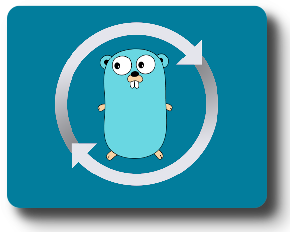

<p align="center">
  
  <h2 align="center">Golang Version Switcher</h2>
  <p align="center">
    <a href="https://github.com/VassilisPallas/gvs/actions?workflow=build"></a>
    <a href="https://goreportcard.com/report/github.com/VassilisPallas/gvs"></a>
    <a hre="https://opensource.org/licenses/MIT"></a>
    <a hre="https://app.fossa.com/projects/git%2Bgithub.com%2FVassilisPallas%2Fgvs?ref=badge_shield"></a>
  </p>
</p>

## Table of Contents

- [Intro](#intro)
- [About](#about)
- [Installation](#installation)
    - [MacOS](#macos)
    - [Linux](#linux)
    - [Install from source](#install-from-source)
- [Usage](#usage)
    - [Use the dropdown to select a version](#use-the-dropdown-to-select-a-version)
    - [See all versions including release candidates (rc)](#see-all-versions-including-release-candidates-rc)
    - [Install latest version](#install-latest-version)
    - [Install specific version](#install-specific-version)
    - [Install from mod file](#install-from-mod-file)
    - [Delete unused versions](#delete-unused-versions)
    - [Refresh version list](#refresh-version-list)
    - [Help](#help)
- [Contributions](#contributions)
    - [Getting started with the project](#getting-started-with-the-project)
- [Licence](#licence)

## Intro

`gvs` allows you to quickly install and use different versions of Go via the command line. The installation is easy. Once installed, simply select the version you desire from the dropdown.

**Example:**
```sh
$ gvs
Use the arrow keys to navigate: ↓ ↑ → ←
? Select go version: 
  ▸ 1.21.3
    1.21.2
    1.21.1
    1.21.0
    1.20.10

✔ 1.21.3
Downloading...
Compare Checksums...
Unzipping...
Installing version...
1.21.3 version is installed!

$ go version
go version go1.21.3 darwin/arm64
```

## About

gvs is a version manager for go, designed to be installed per-user, and invoked per-shell. gvs works on any POSIX-compliant shell (sh, dash, ksh, zsh, bash), in particular on these platforms: unix and macOS.

> [!WARNING]  
> Windows will be supported in a later version.


## Installation

`gvs` is available for MacOS and Linux based operating systems.

> [!IMPORTANT]  
> Make sure to delete any Go versions installed already before installing `gvs`.

### MacOS

gvs is available via [brew](https://brew.sh/).

```sh
$ brew install VassilisPallas/tap/gvs
```

### Linux

Installation for other linux operation systems.

```sh
$ curl -L https://raw.githubusercontent.com/VassilisPallas/gvs/HEAD/install.sh | bash
```

### Install from source

Alternatively, you can install the binary from [source](https://github.com/VassilisPallas/gvs/releases).

## Usage

**Before start using gvs, read the below:**

> [!IMPORTANT]  
> gvs installs the `go` and `gofmt` binaries in `$HOME/bin/`. Make sure to append to your profile file: `export PATH=$PATH:$HOME/bin`, otherwise the terminal will not be able to find them.

### Use the dropdown to select a version

```sh
$ gvs
Use the arrow keys to navigate: ↓ ↑ → ←
? Select go version: 
    1.21.3
  ▸ 1.21.2
    1.21.1
    1.21.0
    1.20.10

✔ 1.21.2
Downloading...
Compare Checksums...
Unzipping...
Installing version...
1.21.2 version is installed!

$ go version
go version go1.21.2 darwin/arm64
```

1. Select the version you want to be installed by using the up and down arrows.
2. Hit **Enter** to select the desired version.

### See all versions including release candidates (rc)

To see a list with all versions, stable and unstable (release candidates) ones, just use the `--show-all` flag.

```sh
$ gvs --show-all
Use the arrow keys to navigate: ↓ ↑ → ←
? Select go version: 
  ▸ 1.21.3 (stable)
    1.21.2 (stable)
    1.21.1 (stable)
    1.21.0 (stable)
    1.21rc4 (unstable)
    1.21rc3 (unstable)
    1.21rc2 (unstable)
```

### Install latest version

To install the latest stable version, use the `--install-latest`.

```sh
$ gvs --install-latest
Downloading...
Compare Checksums...
Unzipping...
Installing version...
1.21.3 version is installed!
```

### Install specific version

To install a specific version without using the dropdown, use the `--install-version=value` flag.

```sh
$ gvs --install-version=1.21.3
Downloading...
Compare Checksums...
Unzipping...
Installing version...
1.21.3 version is installed!
```

If the `Minor` version is not specified (`--install-version=1`), the latest `Minor` version is selected from the given `Major` version.

If the `Patch` version is not specified (`--install-version=1.21`), the latest `Patch` version is selected from the given version.

You can also pass Release Candidates, like `1.21rc2`.

### Install from mod file

You can also install a version that is specified in a go.mod file. You can use the flag `--from-mod`. This will look for any `go.mod` file under the same path `gvs` was executed on the terminal.

```sh
$ gvs --from-mod
Downloading...
Compare Checksums...
Unzipping...
Installing version...
1.21.3 version is installed!
```

### Delete unused versions

Every time you install a new version, gvs keeps the previous installed versions, so you can easily change between them. If you want to delete all the unused versions and keep only the current one, use the `--delete-unused` flag.

In the below example, the versions `1.20` and `1.19` are previously installed, and since they are not used (neither of them is the current version you use), they will be deleted after installing the new version 1.21.2.

```sh
$ gvs --delete-unused
Use the arrow keys to navigate: ↓ ↑ → ←
? Select go version: 
    1.21.3
  ▸ 1.21.2
    1.21.1
    1.21.0
    1.20.10

✔ 1.21.2
Downloading...
Compare Checksums...
Unzipping...
Installing version...
1.21.2 version is installed!
Deleting go1.20.
go1.20 is deleted.
Deleting go1.19.
go1.19 is deleted.
All the unused version are deleted!
```

### Refresh version list

gvs caches the versions that are fetched from `https://go.dev/dl` in order to avoid overloading the server with requests.

The cache expires after a week, but if for any reason you'd like to force the fetch, you can use the `--refresh-versions` flag.

```sh
$ gvs --refresh-versions
Use the arrow keys to navigate: ↓ ↑ → ←
? Select go version: 
  ▸ 1.21.3 (stable)
    1.21.2 (stable)
    1.21.1 (stable)
    1.21.0 (stable)
    1.21rc4 (unstable)
    1.21rc3 (unstable)
    1.21rc2 (unstable)
```

> [!NOTE]  
> You can combine the flags `--refresh-versions` and `--show-all` to refresh the list and see all the versions.


### Help

For more help you can use the `--help` flag.

## Contributions

Contributions are very much welcomed! In order to contribute, the required version is `1.21.0`.
For more information regarding contributions, feel free to read the [contributing.md](./.github/contributing.md) file.

### Getting started with the project

After cloning the repository on you local machine, you can run the below commands:

```sh
# install the dependencies
make install-deps

# run the tests
make test

# build the project
make build
```

There a many Makefile recipes, feel free to run `make`. The default `make` command will print a short documentation for each recipe.

> [!NOTE]  
> Recipes like `format`, `lint`, `vet` and `test` also run in Github Actions, but it should be nice to run them yourself as well before committing the changes. If you think this needs to be a git hook, I'll be more than happy to include it.


## Licence

See [LICENSE.md](./LICENSE.md)

[](https://app.fossa.com/projects/git%2Bgithub.com%2FVassilisPallas%2Fgvs?ref=badge_large)